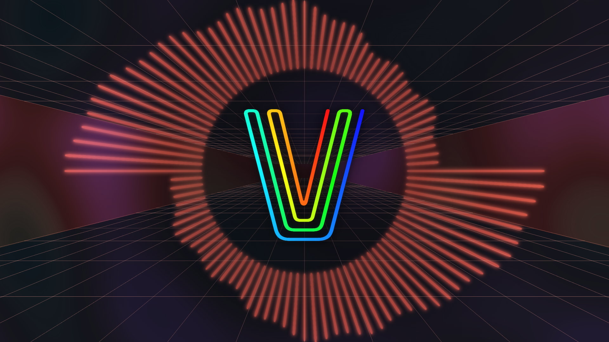

[English](README.md) | **日本語**

<p align="center"></p>

# VisualiEXr

**[▶ ライブデモを試す](https://yager.github.io/VisualiEXr/)** — インストール不要。ブラウザだけでマイク/タブ音声に反応します。

YouTube で再生中の動画の**音にあわせて動くグラフィック（ビジュアライザ）**を画面に重ねて表示する Chrome 拡張です（名前は "Visualizer" を拡張の "EX" で文字ったもので、読みは「ビジュアライザー」）。同じコアで、スタンドアロン（Electron）版と、インストール不要のWebデモ版も動きます。

「いろいろなビジュアライザを**プラグイン的に自由に追加できる**」ことを目標に、既存の拡張を参考にしながらゼロから作っています。

中心にあるのは、**音を扱いやすい数値に変換してからプラグインへ渡す**という一本の流れです。

```
YouTube の音 → 特徴量エンジン → AudioFeatures（0〜1 に正規化した数値セット） → プラグインが描画
```

プラグインは音響解析を一切知らなくてよく、`features.bass * canvas.height` のように**数値を掛けるだけ**で音に反応する絵が描けます。

---

## クイックスタート

3つのホストがあります。`npm install` → `npm run build` で全て出力されます（`dist-extension/`＝拡張、`dist-app/`＝Electron、`dist-web/`＝Webデモ）。

### A. Chrome 拡張（YouTube 重ね）
1. Chrome で `chrome://extensions` → 「デベロッパーモード」ON
2. 「パッケージ化されていない拡張機能を読み込む」→ `dist-extension/` を選ぶ
3. YouTube で再生 → **動画右上の ⚙** でビジュアライザ切替 / **Off**。選択は保存され次回も復元。

### B. スタンドアロン（VJ / プロジェクタ / OBS）
```bash
npm install   # 初回のみ（electron を含む）
npm start     # ビルド → Electron 起動（出力ウィンドウ＋操作ウィンドウ）
```
- **出力ウィンドウ**＝全画面キャンバス（プロジェクタ or OBS のウィンドウキャプチャへ）
- **操作ウィンドウ**＝手元だけ。入力デバイス選択・切替・Off（観客に見せない）
- 完全ローカル（localhost・ネット不要）。マイク/ライン/仮想デバイス（BlackHole 等）から入力

### C. Web版ライブデモ（インストール不要）
GitHub Pages 等の静的ホスティングで動く、マイク/タブ音声反応のデモ＋公式ランディング（`src/hosts/web/`）。
```bash
npm run build
npm run serve:web   # = npx serve dist-web（ローカル確認用）
```
GitHub Pages への公開は [`.github/workflows/deploy-web.yml`](.github/workflows/deploy-web.yml) を参照
（要・人間の作業: リポジトリの Settings > Pages > Source を "GitHub Actions" に変更）。

型チェックは `npm run typecheck`。**プラグインは [`src/visualizers/`](src/visualizers) に `〜Visualizer.ts` を足してビルドするだけ**で自動で一覧に並びます（作り方は [docs/architecture.ja.md](docs/architecture.ja.md#新しいプラグインの作り方)）。

---

## ドキュメント

| ドキュメント | 内容 |
|------|------|
| [docs/audio-basics.md](docs/audio-basics.md) | **音の基礎知識**（周波数・FFT・倍音・対数・キー・リズムなど）。音楽が専門でなくても上から順に読める入門。 |
| [docs/visualizer-basics.md](docs/visualizer-basics.md) | **描画の基礎知識**（シェーダ・WebGL・GLSL・three.js/PixiJS・パーティクル等）。Web開発者向けにCG/ゲーム畑の語彙を解説。 |
| [docs/features.ja.md](docs/features.ja.md) | **AudioFeatures リファレンス**。プラグインに渡る数値セットの完全な定義とデバッグ表示の説明。 |
| [docs/architecture.ja.md](docs/architecture.ja.md) | **設計**。特徴量エンジン・正規化の方針・プラグイン機構・ビルド/動作。 |
| [docs/original-extension.md](docs/original-extension.md) | 参考にした**元拡張の解析メモ**。 |

まず音の仕組みを知りたい → audio-basics、リッチな描画（シェーダ/WebGL）を知りたい → visualizer-basics、使える材料を知りたい → features、作りの中身を知りたい → architecture、の順が読みやすいです。

---

## リポジトリ構成（概要）

| パス | 役割 |
|------|------|
| `src/audio/` | 特徴量エンジン（`FeatureEngine` → `AudioFeatures`）と補助（`AutoGain` / `TempoTracker`） |
| `src/visualizers/` | プラグインと契約（`Visualizer`）＋サンプル（`Analyzer` / `Bars` / `Circle` / `Plasma Scope` / `Plasma Ball` / `Lo-Fi Rain` / `Flow Field` / `PixiNeon` / `Fireworks` / `ThreeTerrain` / `Cyber Flight` / `EQ Field` / `Kaleido Glass` / `Chroma Flow` / `Tunnel` / `Water Caustics`） |
| `src/app/` | 実行コア（入力/出力非依存）。`AudioGraph` / `Stage`（`VideoStage`/`WindowStage`）/ `VisualizerApp` / `registry` |
| `src/hosts/extension/` | 拡張ホスト（YouTube の video 入力＋動画重ね） |
| `src/hosts/standalone/` | スタンドアロンホスト（マイク入力＋全画面出力＋操作ウィンドウ） |
| `src/hosts/web/` | Webホスト（GitHub Pages等の静的配信・マイク/タブ音声入力＋単一ページのランディング兼デモ） |
| `electron/main.cjs` | Electron メイン（localhost 配信＋2ウィンドウ） |
| `public/manifest.json`, `build.mjs`, `gen-plugins.mjs` | 拡張マニフェスト・esbuild ビルド・プラグイン自動登録 |

新しいビジュアライザの作り方は [docs/architecture.ja.md](docs/architecture.ja.md#新しいプラグインの作り方) を参照してください。

---

## ライセンス

MIT License（[LICENSE](LICENSE)）。自由に使用・改変・再配布・商用利用できます（著作権表示の同梱のみ条件・無保証）。
プラグインも同じ精神で、`author` にクレジットを入れて自由に書いて配れます。

同梱するサードパーティ製ライブラリ（three.js / PixiJS / pixi-filters、いずれも MIT）の帰属表示は
[THIRD_PARTY_LICENSES.md](THIRD_PARTY_LICENSES.md) にまとめています。

---

## 支援・スポンサー

VisualiEXr は無料・オープンソースです。開発の継続を応援いただける場合は、任意の寄付を歓迎します（対価はありません）。

- 寄付（Stripe）：<https://donate.stripe.com/7sY3cw6r7aaI7rIczv18c00>
- GitHub Sponsors：リポジトリ上部の **Sponsor** ボタンから（有効化後）

法的表記は Web版（GitHub Pages）の [プライバシーポリシー / 利用規約 / 特定商取引法に基づく表記](https://yager.github.io/VisualiEXr/legal/support/) を参照してください。
